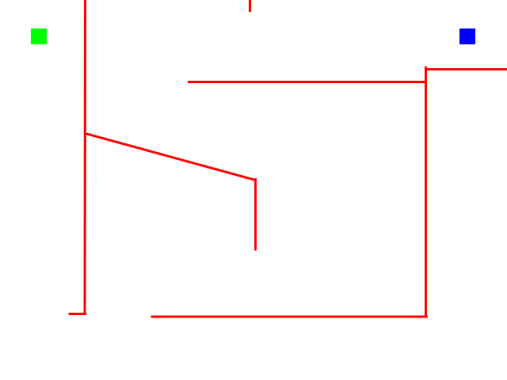
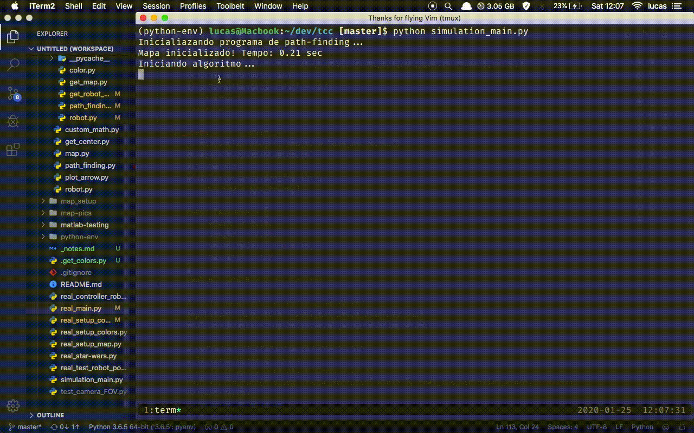

# Senior Paper (Final)

This repository contains the code related to my undergraduate final paper on Mechatronics Engineering. The idea is for a robot to plan and follow a path from inside a maze-like map to a desired goal. To achieve this, the project is composed of two systems:

1. A small differential robot, powered by a NodeMCU (esp8266) and two stepper motors;
2. A separate computer vision system, capable of identifying the whole map from an aerial viewpoint.

The CV system identifies the robot's position inside the map and sends commands to the NodeMCU (through sockets TCP/IP) so that the robot will follow the desired path and reach the end goal.

- To plan the path from beggining to end, we use the algorithm Breadth First Search.

- To follow the planned path, we use a simpler approach to the Steering Behaviour algorithm.

## The simulation

First, a simulation was developed to get familiar with the path-following and path-finding algorithms. The main program is `simulation_main.py`, and in it you can define the robot's dimensions and features as well as choose an image that represents the map. From that image, the simulation will start with the following color-code:

- A green blob is where the robot starts;
- A blue blob represents the robot's goal position;
- Red lines represent the walls of the maze map.

### Simulation results

Giving the following image to the algorithm,

we get the following result:

## Real world application

With the simulation running smoothly, we migrated the software to use a real camera, instead of an image, to find and follow a path from start to finish. Using a camera allows us to create a feedback loop with the path-following algorithm. The script for the real world application is `real_main.py`.

The color code in this script is as follows:

- The green rectangles are reconized as walls;
- The yellow square is recognized as the finish goal;
- The red and blue rectangles expose the position and yaw of the robot;

Note that you also have to specify the robot's dimentions and features, as well as the the map size (in meters), so that we can create a relationship between pixels and meters.

### Real world results

Running the script on a simple map yields the following results:

## Other scripts

Besides the actual applications, there are some scripts that help with the setup:

### Control the robot with a joystick

`real_controller_robot.py` allows to control the robot using a videogame joystick using the pygame library. The following GIF shows it working:

### Setting up colors

To setup the color masks for the real world application, call the script `real_setup_colors.py` and pass the color as an argument on the command line. On the opened window, drag your mouse through the color, like the wand tool on Photoshop, to define the color mask.

### Rotate and crop map from camera

So that you don't have to align the map perfectly with the camera field of view, the script `real_setup_map.py` asks for 3 clicks: on the top left, top right and bottom right of the map, to automatically crop and rotate the actual map from the camera stream. Then, the main program uses these values when grabbing a frame from the camera.

### Play the Star Wars theme

Since the stepper motors generate a sound frequency more or less proportional to their rotating speed, we identified the speeds that result in a sequency of notes playing a very out-of-tune Star Wars theme. The script is `real_star-wars.py`.